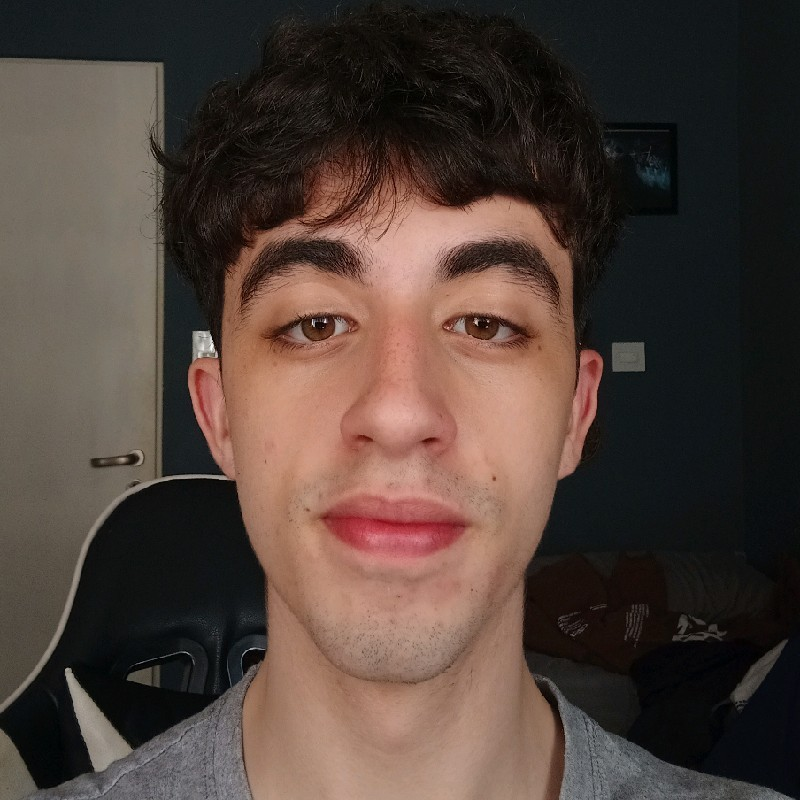
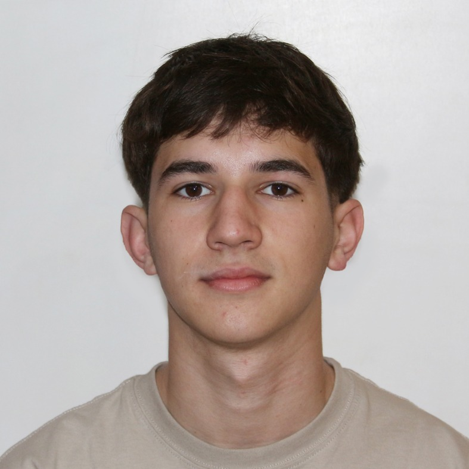
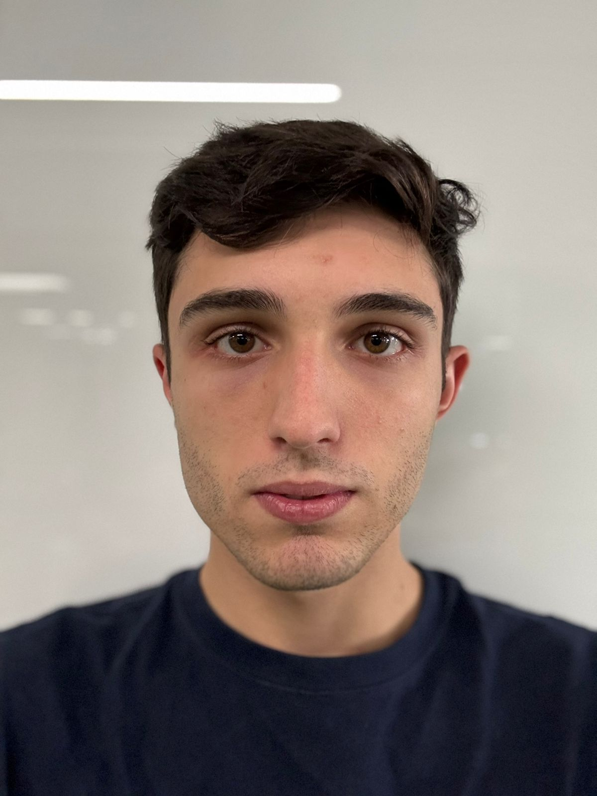
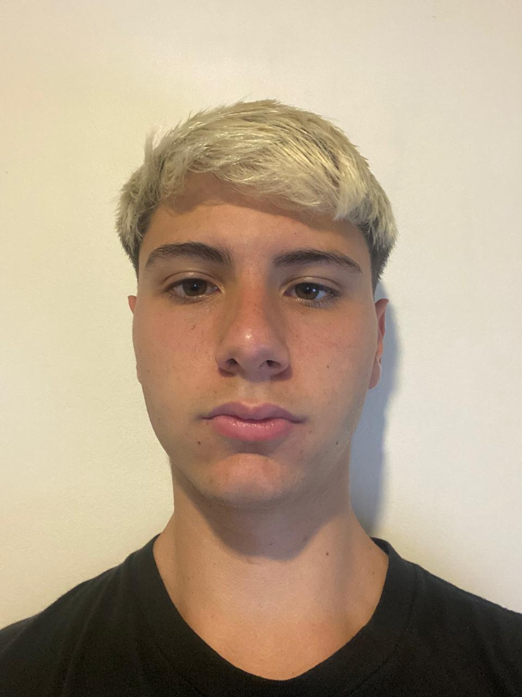
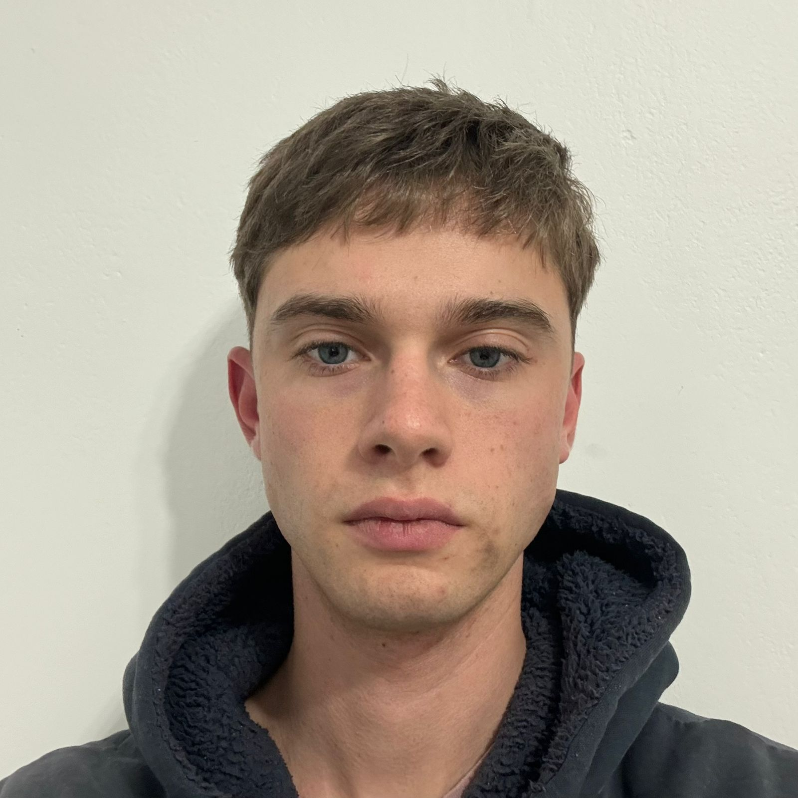
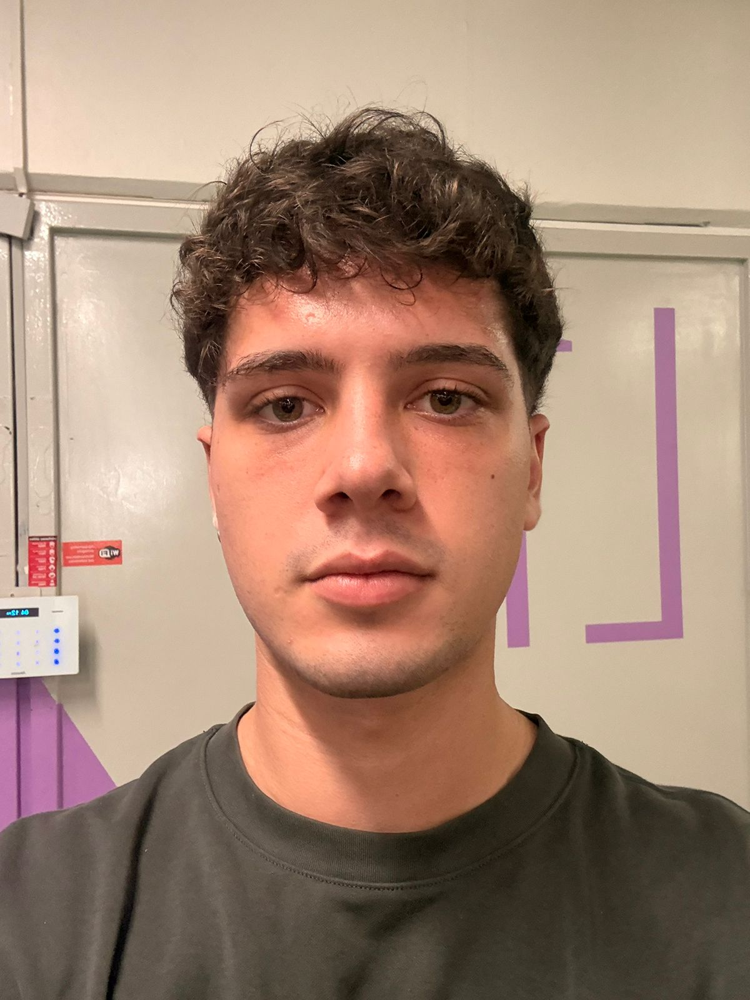

# ChikiChiki - Jueves Tarde

### Repositorio de actividades grupales

## Integrantes

<table align="center">
  <tr>
    <td align="center" valign="top" width="270">
      
       
      <strong>Juan Francisco Sampieri</strong>
       
      Legajo: 1214467
       
      <em>Técnico en informática, interesado en adentrarse más en el mundo del producto y AI. Tengo 20 años, me gusta mucho star wars y doy clases de programación en un secundario técnico</em>
    </td>
    <td align="center" valign="top" width="270">
      
       
      <strong>Manuel Gaynor</strong>
       
      Legajo: 1213617
       
      <em>Interesado en crecer y aprender en el mundo de la programación,
      siempre compitiendo conmigo mismo y buscando mejorar cada día.</em>
    </td>
    <td align="center" valign="top" width="270">
      
       
      <strong>Tiziano Schipani</strong>
       
      Legajo: 1214840
       
      <em>Enfocado en aprender, mejorar y crecer como programador</em>
    </td>
  </tr>
  <tr>
    <td align="center" valign="top" width="270">
      
       
      <strong>Francisco Seeber</strong>
       
      Legajo: 1214975
       
      <em>Muy interesado en la programación, en la IA y disfruto mucho el proceso de analizar problemas, probar distintas ideas y llegar a una solución funcional</em>
    </td>
    <td align="center" valign="top" width="270">
      
       
      <strong>Luka Subotovsky</strong>
       
      Legajo: 1207995
       
      <em>Motivado por el crecimiento personal y profesional, enfocado en adquirir experiencia en programación a través de la práctica, el estudio y la resolución de desafíos reales</em>
    </td>
    <td align="center" valign="top" width="270">
      
       
      <strong>Santiago Matias Luro</strong>
       
      Legajo: 1223038
       
      <em>Interesado en el mundo de la programación y su crecimiento constante.
      Aprendiendo y mejorando a través de la práctica</em>
    </td>
  </tr>
</table>

---

## Registro de actividades

| Fecha      | Actividad                                                |
|------------|----------------------------------------------------------|
| 19/03/2026 | Creacion del repositorio y README   Actividades 1 y 2 |
| 26/03/2026 | Actividad 2, Bloque 1   Consignas 1 a 6               |
| 08/04/2026 | Actividad 2, Bloque 2 y 3   Completos                 |
| 09/04/2026 | Actividad 2, Bloque 4 y 5   Avances                   |
<!-- Agregar nuevas filas arriba de este comentario -->

---

*ChikiChiki - Jueves Tarde | 2026 | Java*

